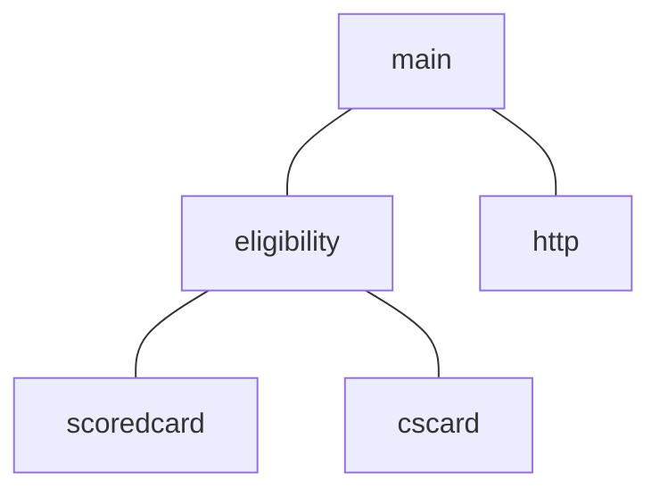
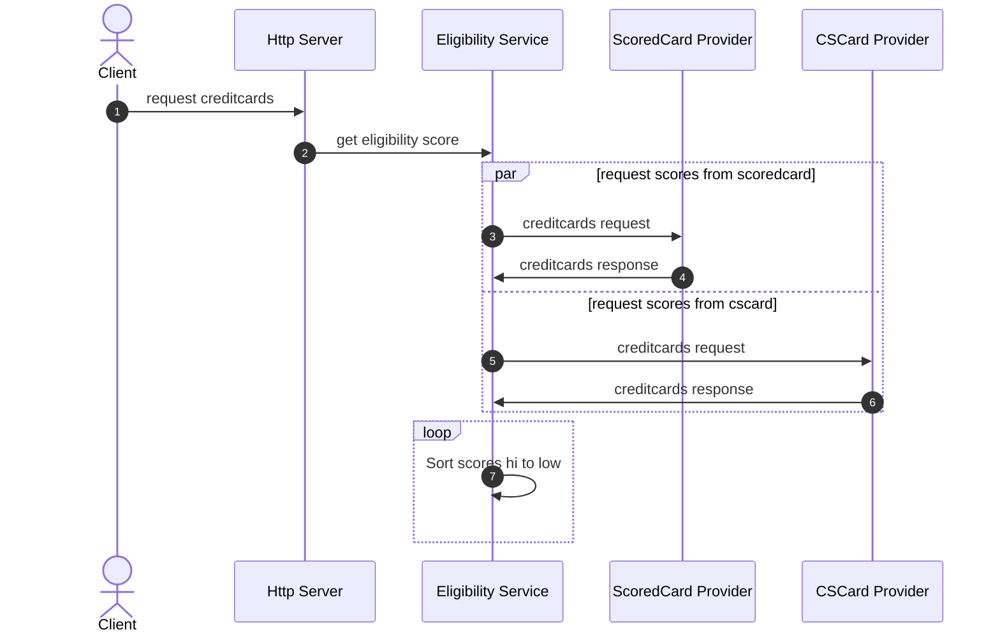

# Clear Score Technical Test

## References

- Akka Http
- Akka Actors (Clusters)
- Robert C Martin Clean Architecture

## Architecture

### Supervision Tree

```mermaid
flowchart TD
main
eligibility
scoredcard
cscard
http

main---http & eligibility
eligibility---scoredcard & cscard
```

### Actor Flow

```mermaid
sequenceDiagram
  autonumber
  actor client as Client
  participant http as Http Server
  participant eligibility as Eligibility Service
  participant scoredcard as ScoredCard Provider
  participant cscard as CSCard Provider

  client->>http: request creditcards
  
  http->>eligibility: get eligibility score

  par request scores from scoredcard
    eligibility->>scoredcard: creditcards request
    scoredcard->>eligibility: creditcards response
  and request scores from cscard
    eligibility->>cscard: creditcards request
    cscard->>eligibility: creditcards response
  end

  loop
    eligibility->>eligibility: Sort scores hi to low
  end
```