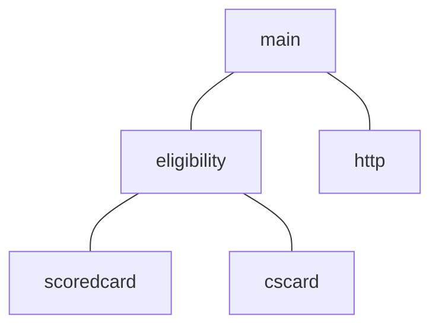
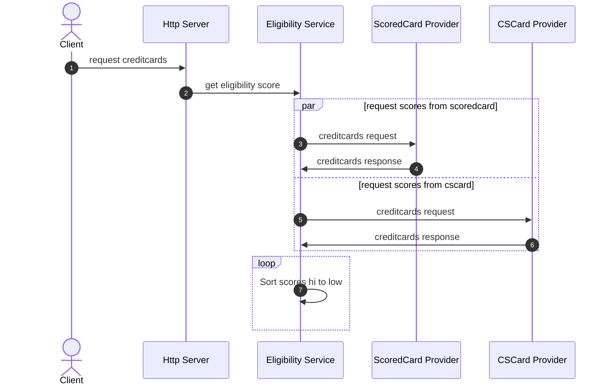

# Scala Project

## References

- Akka Http
- Akka Actors
- [Robert C Martin Clean Architecture](https://www.youtube.com/watch?v=Nsjsiz2A9mg&t=2415s)
- Typesafe Cats

## How to Run

### Requirements

- Docker
- Docker Compose
- Scala 3
- SBT 1.7.1
- JDK

### Start Methods

Please change the .env if you would like to update the environment variables.

1. **Script** `
    - ```
   chmod +x ./start.sh
   ./start.sh
     ```
2. **NPM**
    - `npm start`
    - `npm run start:local`
    - `npm run start:docker`
3. **Docker Compose**
    - `docker compose up --build`
      By running it in docker compose the sagger definitions is pulled in as well and can be reached at http://localhost/swagger/
4. **Manual**
    - ```
   export HTTP_PORT=8080
   export CSCARDS_ENDPOINT=https://app.clearscore.com/api/global/backend-tech-test/v1/cards
   export SCOREDCARDS_ENDPOINT=https://app.clearscore.com/api/global/backend-tech-test/v2/creditcards
   sbt run
     ```

## Architecture

### Supervision Tree



### Actor Flow


